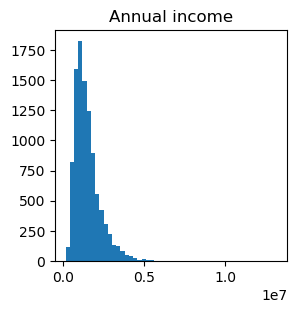
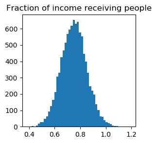
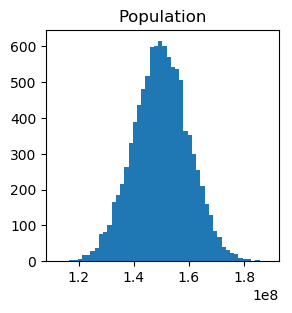

# Monte-Carlo Guesstimate with confidence

From wikipedia:

> "A back-of-the-envelope calculation is a rough calculation, typically jotted down on any available scrap of paper such as the actual back of an envelope. It is more than a guess but less than an accurate calculation or mathematical proof."

Instead of coming up with a single-value estimate, this app generates distribution and draws interval covering 95% of the distribution.
As an input, it takes a function that computes a quantity to estimate.
Each argument of this function is specified by its distribution.
Monte-Carlo simulations are performed to come up with a distribution of the output quantity.


This software is similar to
<https://github.com/getguesstimate/guesstimate-app>, but simpler, uses python
and has programmatic interface instead of graphical.

# Dependencies

* python3
* numpy
* matplotlib

# Usage

Use as a commandline tool
```{.bash}
python gst.py ./default_model.py
```

Copy and modify `./default_model.py`.
Run with your modified file. Profit?

# Results for `default_model.py`


This model estimates GDP of Russia as **GDP=pfs/60**, where p is population, f is fraction of
income receiving citizens, s is annual income in RUB. "/60" converts RUB to USD.




.png)

# References

* <https://en.wikipedia.org/wiki/Guesstimate>
* <https://en.wikipedia.org/wiki/Back-of-the-envelope_calculation>
* <https://en.wikipedia.org/wiki/Fermi_problem>

